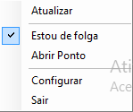

# Lembrete de ponto

Este software tem como objetivo auxiliar pessoas que utilizam a central de funcionários a lembrar de realizar as suas marcações de ponto e controlar o banco de horas.

O sistema consulta o horário cadastrado e o saldo do banco de horas e emite os alertas para lembrar o usuário de realizar as marcações de forma a atender o horário cadastrado e compensar as horas positivas ou negativas do banco de horas do funcionário.

**Atenção: O sistema somente avisa quando deve ser batido o ponto, mas responsabilidade de bater é inteiramente do usuário**

## Como funciona?

Ao realizar o login, o sistema consulta os dados do usuário no sistema, obtendo o nome, o cargo, os horários cadastradas, as batidas e o saldo do banco de horas do dia anterior.

A partir destes dados o sistema calcula quando deve ser a próxima marcação de entrada/saída.

No horário marcado, o sistema verifica se houve a marcação e, caso ela esteja pendente, ele exibe um alerta para o usuário. 

O sistema continuará verificando as marcações e exibindo alertas até que o usuário bata o ponto, contribuindo para que o mesmo não se esqueça.

Por uma questão de comodidade, caso o usuário clique no alerta o navegador abrirá na página do ponto.

## Instalação

Segue o passo a passo da instalação:

1 - Baixar o instalador no endereço https://github.com/hermsdorff/Lembrete-de-Ponto/raw/master/LembretePonto.msi

2 - Executar o arquivo LembretePonto.msi

3 - Na tela de bem vindo clique em Avançar

4 - Na tela de seleção de pasta você pode informar quer instalar o software e clicar em Avançar. **Recomendo deixar o valor padrão**

5 - Na tela de confirmação, clicar em Avançar.

Neste momento o Windows perguntará se você permite que o aplicativo de um fornecedor desconhecido faça alterações no dispositivo... bem, o fornecedor desconhecido sou eu e para instalar o programa você deve responder que sim

6 - Na tela final clique em fechar. Deixe o checkbox marcado para carregar que o lembrete de ponto seja iniciado imediatamente

Após a instalação aparecerá um ícone de relógio na área de trabalho 

Caso o Lembrete de Ponto tenha sido iniciado, aparecerá o mesmo ícone na bandeja do sistema, próximo ao relógio. Caso não esteja aparecendo, você deve dar duplo clique no atalho da área de trabalho, para iniciar o programa.

## Configurações

Clicando com o botão direito sobre o ícone aparece o seguinte menu

A seguir uma descrição das opções:

- **Atualizar**: O programa consulta novamente os dados do ponto do usuário
- **Estou de folga**: Se marcado o programa considera que o dia atual não deve ter marcações e não emite novos alertas. A marcação é automaticamente desfeita quando iniciar o próximo dia
- **Abrir Ponto**: Abre a página da central do funcionário com o navegador padrão
- **Configurar**: Abre a janela de configuração
- **Sair**: O Lembrete de ponto é finalizado

A janela de configuração possui 4 seções conforme a imagem abaixo:

### Central do Funcionário

Possui os dados de acesso a central do funcionário. Estes são os mesmos dados utilizados para acessar a página da central dos funcionários, fornecido pelo RH

### Geral

Possui informações sobre o programa, sendo:

- **Versão**: Número da versão do programa 
- **Horário da próxima batida**: Horário que o programa espera que seja a próxima batida do ponto. Caso a hora informada seja alcançada ou ultrapassada e você não tiver batido o ponto, o programa emitirá um alerta você.
- **Horário da última atualização**: Mostra quando foi a última vez que o sistema verificou os seus dados e se você bateu o ponto
- **Horário da próxima atualização**: Mostra quando o sistema vai consultar novamente os registros do ponto. Durante o horário de trabalho e pausas, a verificação ocorre a cada 15 minutos. Fora do horário de trabalho a verificação ocorre a cada 1 hora. Caso ocorra algum erro no acesso ao ponto, é feita uma nova tentativa a cada minuto. Casa exista alguma batida pendente, a próxima verificação ocorre a cada 1 minuto ou no intervalo configurado na seção **Preferências**

- **Momento atual do funcionário**: Mostra se o usuário está em horário de trabalho, de refeição, de pausa ou de descanso

### Preferências

- **Compensar banco de horas**: Permite ao usuário definir se o sistema deve ajudá-lo a compensar o saldo do banco de horas existente ou se deve considerar rigorosamente os horários configurados pelo RH. O valor ***true*** ativa a compensação do banco de horas e o valor ***false*** desativa.
  Mas atenção: **A versão atual limita o ajuste diário em 1 hora por dia**
- **Meta do banco de horas**: Nesse campo o usuário informa o número de horas que quer manter no banco de horas. Isso serve para o caso de ser combinado com o gestor de acumular um número de horas para compensar posteriormente com uma folga ou uma saída antecipada. Se a compensação do banco de horas estiver ativa o sistema ajustara os horários dos alertas para ajudar a atingir a meta, seja aumentando, seja reduzindo a carga horária diária
- **Horário de costume para a refeição**: Caso o usuário costume almoçar em um horário diferente do horário configurado no ponto, ele pode informar nesse campo. O sistema passará a considerar este horário para o início da refeição e fará o ajuste necessário no horário da próxima entrada
- **Substituir o horário da refeição**: Se estiver com o valor ***true***, o sistema considerará o horário da opção acima como horário de início da refeição. se estiver com o valor ***false*** o sistema considerará o horário configurado pelo RH, ignorando o horário da opção acima
- **Intervalo entre notificações**: Informa o intervalo entre as notificações que o sistema gera é esperado que o usuário bata o ponto, mas ele ainda não bateu. O valor padrão é 1 minuto, o que significa que se chegar o horário previsto para bater o ponto e o sistema identificar que o usuário ainda não bateu, ele aguardará 1 minuto e fará nova verificação e novo alerta.
  Mas atenção: **A partir do momento que o usuário bate o ponto o sistema para de emitir os alertas e um intervalo muito grande pode favorecer o esquecimento**

### Restrições

- **Não iniciar antes de**: O horário mínimo que o usuário pode começar a trabalhar. O sistema não emitirá alertas antes deste horário
- **Não trabalhar após**: O horário máximo que o usuário pode trabalhar. Caso o usuário esteja em trabalho após esse horário o sistema emitirá alertas periodicamente até que o usuário bata o ponto de saída
- **Intervalo mínimo de refeição**: Informa o tempo mínimo de refeição. Este tempo é considerado quando o sistema reduz o horário de almoço para compensar atrasos ou o banco de horas.
- **Intervalo mínimo de pausas**: Este campo contém ó tempo mínimo para pausas não programadas. Caso o usuário precise sair no meio do expediente para resolver algum assunto pessoal e bata o ponto saindo, o sistema identificará a saída não programada e só emitirá novos alertas para o usuário não esquecer do ponto de volta após o tempo informado nesse campo

Após informar os dados, ao se clicar em **Aplicar**, o sistema fará uma consulta no banco e emitirá um alerta com os dados pessoais informados.

Mas atenção: **Tanto o botão OK quanto o Aplicar salvam as configurações**

O botão **Cancelar** descarta as configurações e carrega novamente os valores anteriores

## Regras da compensação de horas

O cálculo dos horários dos alertas é dinâmico. Portanto, se o usuário bater o ponto em horário diferente do horário previsto pelo sistema, o próximo horário será calculado considerando o registro do ponto efetivamente batido pelo usuário

### Entradas e saídas antecipadas

Se o usuário iniciar o dia mais tarde, o sistema compensará o atraso na saída para a refeição, respeitando a restrição de **Intervalo mínimo de refeição**. Caso não seja possível compensar o atraso completamente, a diferença será compensada após o horário normal de trabalho, respeitando a restrição **Não trabalhar após**

Se o usuário inicia o dia mais cedo, o sistema compensará a diferença no horário de almoço. Caso não seja possível compensar completamente no horário de almoço, o tempo restante será compensado no fim do horário normal de trabalho

Se o usuário sair para refeição em horário diferente do previsto, o sistema considerará esse horário para calcular quando deve ser o retorno da refeição.

Se o usuário reduzir o tempo de refeição ou fizer um intervalo maior do que o esperado, a diferença será compensada ao fim do horário normal de trabalho, respeitando a restrição **Não trabalhar após**

### Banco de horas

Se o usuário tem saldo no banco de horas diferente do valor configurado em **Meta do banco de horas**, o sistema ajustará os alertas de forma a compensar até 1 hora por dia, respeitando todas as restrições configuradas

Se o saldo do banco de horas é menor que a **Meta do banco de horas**, o sistema iniciará o dia considerando que a primeira entrada pode ser antecipada, respeitando a restrição **Não iniciar antes de**. Caso necessário, o sistema atrasará o horário da saída de refeição respeitando a restrição **Intervalo mínimo de refeição**. Caso estas medidas não tenham sido suficientes para o usuário compensar o tempo previsto, o sistema compensará no fim do horário, respeitando a restrição **Não trabalhar após**

Se o saldo do banco de horas é maior que a **Meta do banco de horas**,  o sistema iniciará o dia considerando que a primeira entrada pode ser atrasada em até meia hora. Caso necessário o sistema atrasará o retorno da refeição para compensar o tempo restante mantendo o limite máximo de 2 horas para o horário de refeição

